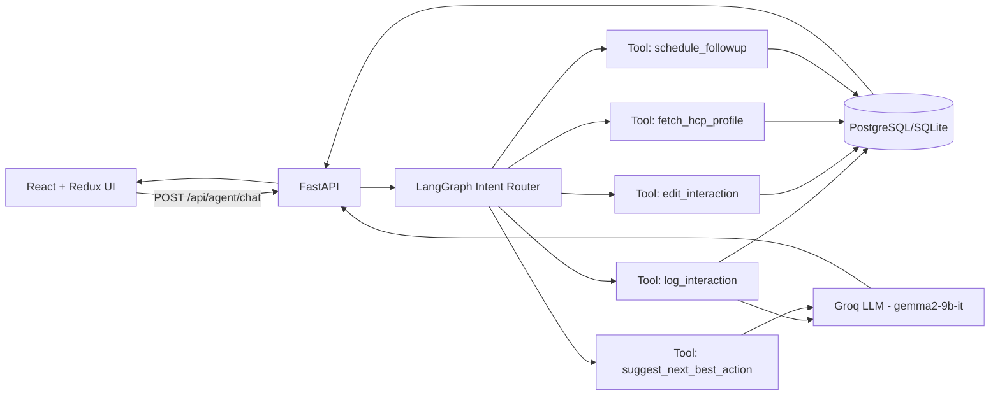
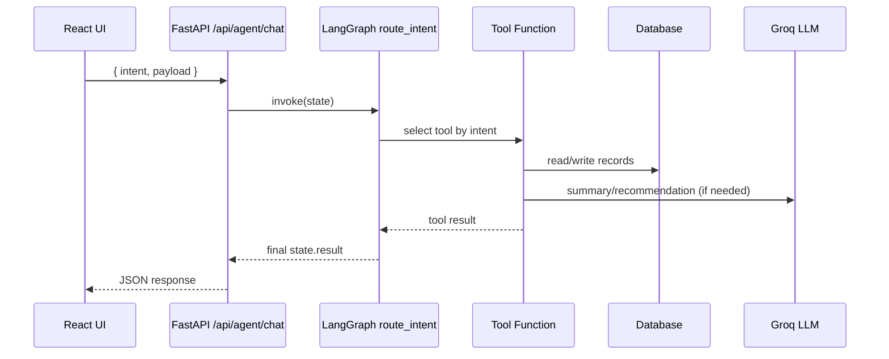

<!-- Minimal animated header -->
<p align="center">
  
</p>

<h1 align="center">AI-First CRM HCP Assistant</h1>

<p align="center">
AI-powered CRM assistant for managing <b>HCP (Healthcare Professional)</b> interactions, generating AI summaries, and recommending next actions.
</p>

<p align="center">
  
  
  
  
  
  
</p>

---

## 📌 Overview

This project helps field reps log doctor interactions quickly using:
- **Structured Form Input**
- **Conversational Agent Intent API**

It combines a standard CRM flow with an AI layer for:
- interaction summarization
- next-step guidance
- follow-up management

---

## 🚀 Core Capabilities

- Log HCP interactions
- Generate AI summaries from notes (Groq LLM)
- Edit interaction records
- Fetch HCP profile details
- Suggest next best actions
- Schedule follow-up tasks

---

## 🧰 Tech Stack

### Backend
<p>
  
  
  
  
  
  
</p>

### Frontend
<p>
  
  
  
  
</p>

### Database
<p>
  
  
</p>

> **LLM model used:** `gemma2-9b-it` (Groq)

---

## 🏗️ Architecture

### High-Level Flow


### Intent Execution Flow


---

## 📁 Repository Structure

```text
backend/
  app/
    api/
      agent.py
      interactions.py
    db/
      session.py
    models/
      hcp.py
      interaction.py
      audit.py
      followup.py
    services/
      llm.py
    tools/
      log_interaction.py
      edit_interaction.py
      fetch_hcp.py
      suggest_nba.py
      schedule_followup.py
    main.py

frontend/
  src/
    api/client.js
    features/
      interaction/InteractionForm.jsx
      chat/AgentChat.jsx
    App.jsx
```

---

## 🛠️ Implemented LangGraph Tools (5)

1. **log_interaction**  
   Creates interaction and generates AI summary.

2. **edit_interaction**  
   Updates selected interaction fields.

3. **fetch_hcp_profile**  
   Returns doctor details from HCP table.

4. **suggest_next_best_action**  
   Provides action suggestions from context/sentiment.

5. **schedule_followup**  
   Creates follow-up task linked to interaction.

---

## ✅ Prerequisites

- Python 3.10+
- Node.js 18+
- npm
- Valid Groq API key

---

## ⚙️ Backend Setup

```bash
cd backend
python -m venv .venv
source .venv/bin/activate
pip install -r requirements.txt
```

Create `backend/.env`:

```env
GROQ_API_KEY=your_groq_api_key_here
GROQ_MODEL=gemma2-9b-it
```

Run backend:

```bash
uvicorn app.main:app --reload --port 8000
```

Backend URLs:
- API: `http://127.0.0.1:8000`
- Swagger: `http://127.0.0.1:8000/docs`

---

## 💻 Frontend Setup

```bash
cd frontend
npm install
npm run dev
```

Frontend URL:
- `http://localhost:5173`

---

## 🔌 API Contract

### Endpoint
`POST /api/agent/chat`

### Request Body
```json
{
  "intent": "log_interaction",
  "payload": {
    "hcp_id": 1,
    "interaction_type": "Meeting",
    "interaction_date": "2026-04-17",
    "topics_discussed": "Discussed Product X efficacy and phase-3 trial outcomes.",
    "attendees": "Dr. Amit Sharma"
  }
}
```

### Supported Intents
- `log_interaction`
- `edit_interaction`
- `fetch_hcp_profile`
- `suggest_next_best_action`
- `schedule_followup`

---

## 🧪 Example Requests

### Log Interaction
```bash
curl -X POST http://127.0.0.1:8000/api/agent/chat \
-H "Content-Type: application/json" \
-d '{
  "intent":"log_interaction",
  "payload":{
    "hcp_id":1,
    "interaction_type":"Meeting",
    "interaction_date":"2026-04-17",
    "topics_discussed":"Discussed Product X efficacy in diabetic patients and shared positive trial outcomes.",
    "attendees":"Dr. Amit Sharma"
  }
}'
```

### Fetch HCP Profile
```bash
curl -X POST http://127.0.0.1:8000/api/agent/chat \
-H "Content-Type: application/json" \
-d '{
  "intent":"fetch_hcp_profile",
  "payload":{"hcp_id":1}
}'
```

### Suggest Next Best Action
```bash
curl -X POST http://127.0.0.1:8000/api/agent/chat \
-H "Content-Type: application/json" \
-d '{
  "intent":"suggest_next_best_action",
  "payload":{"sentiment":"positive"}
}'
```

### Schedule Follow-up
```bash
curl -X POST http://127.0.0.1:8000/api/agent/chat \
-H "Content-Type: application/json" \
-d '{
  "intent":"schedule_followup",
  "payload":{
    "interaction_id":1,
    "due_date":"2026-04-20",
    "owner":"Prateek",
    "note":"Share efficacy deck"
  }
}'
```

### Edit Interaction
```bash
curl -X POST http://127.0.0.1:8000/api/agent/chat \
-H "Content-Type: application/json" \
-d '{
  "intent":"edit_interaction",
  "payload":{
    "interaction_id":1,
    "updates":{"attendees":"Dr. Amit Sharma, Dr. Neha"}
  }
}'
```

---

## 🎥 Demo Walkthrough (Suggested)

1. Open frontend (`localhost:5173`)
2. Log an interaction
3. Show generated AI summary
4. Fetch HCP profile
5. Suggest next best action
6. Schedule a follow-up
7. Edit an existing interaction

---

## 📎 Validation & Data Notes

- `hcp_id` must reference an existing HCP record.
- Invalid `hcp_id` returns validation error.
- Demo uses seeded/hardcoded HCP records.

---

## 🧯 Troubleshooting

### 500 error while logging interaction
Possible cause: invalid foreign key (`hcp_id` not found in
